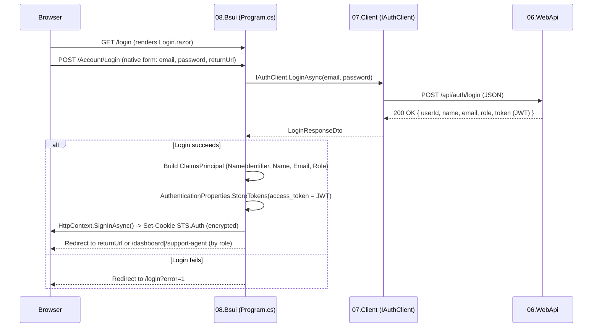

# Authentication Migration: JWT + Custom Provider → ASP.NET Core Native Cookie Auth

> English version. Bahasa Indonesia: [authentication-id.md](./authentication-id.md)

## 1. Background

Previously, `08.Bsui` (Blazor Web App, Interactive Server) stored the JWT issued at login in `ProtectedLocalStorage`, and a `CustomAuthStateProvider` manually parsed that JWT into a `ClaimsPrincipal`. Because `AddAuthentication()`/`IAuthenticationService` was never registered, the built-in `[Authorize]` attribute failed with:

```
Unable to find the required IAuthenticationService service.
```

This migration replaces that entire mechanism with **native ASP.NET Core cookie authentication** on the Blazor UI side, while **still keeping the Web API's JWT as the source of identity** — the JWT is no longer sent to the browser as a standalone value; instead it is stored inside an encrypted authentication cookie (via Data Protection) and forwarded back to the Web API behind the scenes whenever `08.Bsui` calls an API endpoint.

**`06.WebApi` was not changed at all** — it remains JWT Bearer Authentication exactly as before.

## 2. What Was Removed

| File | Reason |
|---|---|
| `08.Bsui/Services/CustomAuthStateProvider.cs` | Replaced by the framework's built-in `AuthenticationStateProvider` (auto-wired by `AddCascadingAuthenticationState()` + cookie auth) |
| `08.Bsui/Services/ProtectedLocalStorageTokenProvider.cs` | The JWT is no longer manually stored in browser localStorage |
| `07.Client/Features/Interfaces/ITokenProvider.cs` | No longer relevant — the token is read from the cookie, not localStorage |
| `MarkUserAsAuthenticated()` / `MarkUserAsLoggedOut()` logic | Login/logout now go through native ASP.NET Core `SignInAsync`/`SignOutAsync` |

## 3. What Was Added / Changed

### `07.Client` (pure class library, no ASP.NET Core dependency)

- **`JwtForwardingHandler.cs`** (new, replaces the old fully-commented-out `AuthHeaderHandler.cs`): a `DelegatingHandler` that attaches an `Authorization: Bearer <token>` header to every outgoing HTTP request. This handler knows nothing about `HttpContext` or cookies — it only takes a `Func<Task<string?>>` delegate through its constructor to fetch the token on demand. This keeps `07.Client` a pure class library.
- **`DependencyInjection.cs`**: `JwtForwardingHandler` is attached to all four `HttpClient` registrations (`IAuthClient`, `ITicketClient`, `IDashboardClient`, `IUserClient`) via `.AddHttpMessageHandler<JwtForwardingHandler>()`.
- **`DashboardClient.cs`** & **`TicketClient.cs`**: stripped of the old manual token-attaching logic (`ITokenProvider`) — the handler above now does this transparently.

### `08.Bsui` (has `HttpContext` access, supplies the real implementation of the delegate above)

- **`Services/ServerJwtAccessor.cs`** (new): a scoped service that reads the token from `HttpContext.GetTokenAsync("access_token")` and **caches** the result in an instance field. This matters because `HttpContext` is only available during the initial HTTP request (page load / SignalR circuit establishment) — later interactions on the same circuit (button clicks, navigation) run purely over the SignalR socket with no `HttpContext`, so the cached value is reused.
- **`Program.cs`**:
  - `AddAuthentication(CookieAuthenticationDefaults.AuthenticationScheme).AddCookie(...)` — cookie named `STS.Auth`, 8-hour lifetime (`ExpireTimeSpan`, matching the backend JWT's lifetime), `SlidingExpiration = true`, `LoginPath = "/login"`.
  - `AddAuthorization()` — enables evaluation of `[Authorize]` / `[Authorize(Roles=...)]`.
  - `AddHttpContextAccessor()` plus registration of the `Func<Task<string?>>` delegate pointing to `ServerJwtAccessor.GetTokenAsync` — this is the delegate consumed by `JwtForwardingHandler` in `07.Client`.
  - `app.UseAuthentication()` and `app.UseAuthorization()` added to the pipeline (before `UseAntiforgery()`).
  - Two new **Minimal API** endpoints: `POST /Account/Login` and `POST /Account/Logout` (details in the Flow section below).
- **`Routes.razor`**: `<RouteView>` replaced with `<AuthorizeRouteView>` (this is what actually enforces `[Authorize]` — a plain `RouteView` performs **no** authorization check at all). The `NotAuthorized` fragment now branches into two cases:
  - **Not authenticated** → renders `RedirectToLogin.razor` (component), redirecting to `/login?returnUrl=...` so the user lands back on the intended page after logging in.
  - **Authenticated but wrong role** (e.g. a `SupportAgent` hitting a `Manager`-only page) → renders `RedirectToUnauthorized.razor` (new component), redirecting to `/unauthorized`. This is detected via `context.User.Identity?.IsAuthenticated` inside the `NotAuthorized` fragment.
- **`Components/Pages/Unauthorized.razor`** (new): a public page at `/unauthorized` showing an "Access Denied" message with two buttons: **Go to Login** (`/login`) and **Back to Home** (`/`).
- **`Login.razor`**: rewritten entirely, see the Flow section below.
- **`NavMenu.razor`**: the Logout link, previously an `@onclick` handler with an empty TODO, is now a native `<form method="post" action="Account/Logout">`.
- **`Home.razor`** (route `/`): `@attribute [Authorize]` added — the root now requires login (previously publicly accessible).
- **4 other pages** (`Dashboard.razor`, `ManagerReport.razor`, `SupportAgents.razor`, `TechnicalAgents.razor`): the previously commented-out `@attribute [Authorize(Roles = "...")]` is now active.

## 4. Why Login Needs a Separate Endpoint Instead of a Razor Component

`App.razor` sets `@rendermode="InteractiveServer"` **globally** on `<Routes>`. As a result, every `.razor` component in the app runs inside an interactive SignalR circuit, and `HttpContext.SignInAsync()`/`SignOutAsync()` **cannot be called from within such a component** (the HTTP response for the request that established the circuit has already been sent). Sign-in/sign-out must therefore happen in a regular HTTP endpoint (Minimal API) with a full request/response lifecycle — not a C# method invoked from a button inside a component.

A direct consequence: the login form **cannot** use `@onclick` to call a C# service — it must be a native HTML `<form method="post">` submitted by the browser directly to that endpoint.

## 5. Login Flow (Step-by-Step)



Step-by-step detail:

1. **`Login.razor`** renders `<form method="post" action="Account/Login">` containing `email` and `password` inputs (visually still `MudTextField`, but given `UserAttributes` so the underlying `<input>` carries a `name` attribute — keeping the Mud look while still submitting natively), a hidden `returnUrl` input, and `<AntiforgeryToken />`. The submit button is a `MudButton` with `ButtonType="ButtonType.Submit"` (not `OnClick`), so the browser submits the form natively instead of a Blazor event handling it.
2. The browser POSTs a form-urlencoded request to `/Account/Login` — the Minimal API endpoint in `Program.cs` receives it via `[FromForm] string email, [FromForm] string password, [FromForm] string? returnUrl`.
3. The endpoint calls `IAuthClient.LoginAsync(...)` — a plain JSON request to `06.WebApi` (`POST /api/auth/login`), exactly as before. The Web API validates credentials and issues a JWT (claim types: `ClaimTypes.NameIdentifier`, `ClaimTypes.Name`, `ClaimTypes.Email`, `ClaimTypes.Role`, 8-hour lifetime).
4. On success, the endpoint builds a new `ClaimsPrincipal` on the Blazor UI side using **the exact same claim types** as the JWT (so `[Authorize(Roles=...)]` and name/email lookups behave consistently).
5. `AuthenticationProperties.StoreTokens([...])` stores the raw JWT (token name: `"access_token"`) **inside** the cookie — the JWT is never sent to the browser as a separate value.
6. `HttpContext.SignInAsync(CookieAuthenticationDefaults.AuthenticationScheme, principal, authProperties)` writes the encrypted `STS.Auth` cookie (Data Protection, keys persisted under `08.Bsui/keys/`).
7. Redirect to `returnUrl` (if present, e.g. from a page that was blocked by `[Authorize]`) or the default `/dashboard` (Manager) / `/support-agent` (other roles).
8. On invalid credentials (`BusinessException` from the backend) or a missing token, redirect to `/login?error=1`; `Login.razor` reads the `error` query parameter via `[SupplyParameterFromQuery]` and shows a `MudAlert`.

## 6. Logout Flow

`NavMenu.razor` → `<form method="post" action="Account/Logout">` + `<AntiforgeryToken />` → the `POST /Account/Logout` endpoint in `Program.cs` calls `HttpContext.SignOutAsync(...)` (removing the cookie) → redirect to `/login`.

## 7. How `[Authorize]` Is Now Actually Enforced

- `AddCascadingAuthenticationState()` (already present before, now actually functional) provides the framework's built-in `AuthenticationStateProvider`, which reads the `ClaimsPrincipal` from the cookie (`HttpContext.User`) when the circuit is established and flows it down as a cascading parameter to the whole component tree.
- `Routes.razor` uses `<AuthorizeRouteView>` (instead of a plain `<RouteView>`) — this is the component that actually reads each page's `@attribute [Authorize]` and decides whether to render the page or the `NotAuthorized` fragment.
- The root (`/`) now also carries `@attribute [Authorize]` (no specific role required — just needs to be logged in), so there is no longer any page reachable without authentication.
- Inside the `NotAuthorized` fragment, the app distinguishes two scenarios so the UX makes sense:
  - An anonymous user (never logged in) → redirected straight to `/login` (showing "Access Denied" to someone who was never logged in wouldn't be useful).
  - A logged-in user whose role isn't allowed on that page → redirected to `/unauthorized`, a page explaining access was denied and offering the option to log in again (e.g. with a different account) or go back to the root.

## 8. How the Token Is Forwarded to the Web API Once the Circuit Is Running

This is the part most likely to be misunderstood: once the SignalR circuit is established, `HttpContext` is **not always available** inside component code anymore. The solution:

1. `ServerJwtAccessor` (scoped, `08.Bsui`) reads `HttpContext.GetTokenAsync("access_token")` **whenever `HttpContext` happens to be available** (typically during the initial request / reconnect), then caches the result in a `_cachedToken` field.
2. If called again while `HttpContext` is `null` (a pure SignalR interaction), it returns the previously cached value.
3. `Program.cs` registers a `Func<Task<string?>>` pointing to `ServerJwtAccessor`'s `GetTokenAsync` method — this is the "bridge" between `08.Bsui` (which has `HttpContext`) and `07.Client` (which must not know about ASP.NET Core).
4. `JwtForwardingHandler` in `07.Client` invokes that delegate on every outgoing request to the Web API and attaches `Authorization: Bearer <token>`.

## 9. File Summary

| Status | File |
|---|---|
| Removed | `08.Bsui/Services/CustomAuthStateProvider.cs` |
| Removed | `08.Bsui/Services/ProtectedLocalStorageTokenProvider.cs` |
| Removed | `07.Client/Features/Interfaces/ITokenProvider.cs` |
| Renamed + rewritten | `07.Client/AuthHeaderHandler.cs` → `07.Client/JwtForwardingHandler.cs` |
| New | `08.Bsui/Services/ServerJwtAccessor.cs` |
| New | `08.Bsui/Components/RedirectToLogin.razor` |
| New | `08.Bsui/Components/RedirectToUnauthorized.razor` |
| New | `08.Bsui/Components/Pages/Unauthorized.razor` (`/unauthorized` page) |
| Modified | `07.Client/DependencyInjection.cs`, `DashboardClient.cs`, `TicketClient.cs` |
| Modified | `08.Bsui/Program.cs`, `Routes.razor`, `Login.razor`, `NavMenu.razor` |
| Modified (added `@attribute [Authorize]`, no specific role) | `Home.razor` (root `/`) |
| Modified (uncommented `[Authorize(Roles=...)]`) | `Dashboard.razor`, `ManagerReport.razor`, `SupportAgents.razor`, `TechnicalAgents.razor` |
| **Not changed** | The entirety of `06.WebApi` (still JWT Bearer Authentication) |

## 10. Notes & Limitations

- **Real-time validation is gone from the login form.** It previously used `MudForm` with client-side FluentValidation. Since the form is now a native `<form method="post">` rather than a Blazor component, field validation moved to server-side only (redirect back with `?error=1`).
- **`STS.Auth` cookie lifetime** is manually kept in sync with the backend JWT lifetime (8 hours, hardcoded both in `AuthService.GenerateJwtToken` and in `Program.cs`). If the backend's JWT duration ever changes, `ExpireTimeSpan` in `Program.cs` must be updated manually — they are not automatically kept in sync.
- **`TechnicalAgents.razor`** still uses `[Authorize(Roles = "Agent, SupportAgent")]` — the value `"Agent"` doesn't exist in the `UserRole` enum (`SupportAgent`, `Manager`), so it effectively never matches anyone. This isn't a bug introduced by this migration — the attribute already read this way before it was uncommented.

## 11. Manual Verification Steps

1. Run `06.WebApi` and `08.Bsui`.
2. Access an `[Authorize]`-protected page (e.g. `/dashboard`) without logging in → should redirect to `/login`.
3. Log in with valid credentials → redirect matches the user's role, protected pages are accessible, data from the Web API (e.g. dashboard summary) loads successfully.
4. Log in with invalid credentials → redirected back to `/login?error=1` with an error message shown.
5. Click Logout → cookie is cleared, access to `[Authorize]`-protected pages is denied again.
