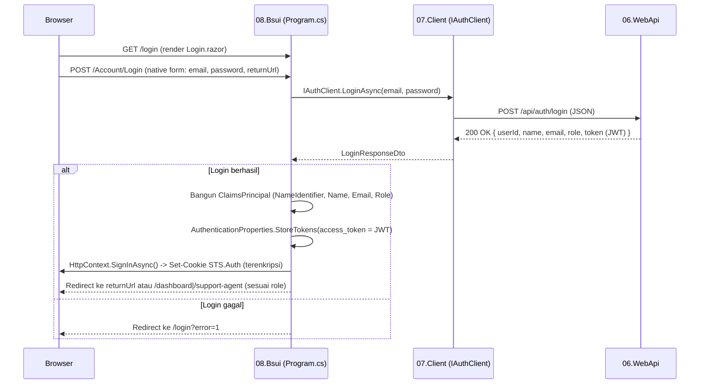

# Migrasi Autentikasi: JWT + Custom Provider → ASP.NET Core Native Cookie Auth

> Bahasa Indonesia. Versi Inggris: [authentication-en.md](./authentication-en.md)

## 1. Latar Belakang

Sebelumnya, `08.Bsui` (Blazor Web App, Interactive Server) menyimpan JWT hasil login di `ProtectedLocalStorage`, lalu sebuah `CustomAuthStateProvider` mem-parsing JWT tersebut secara manual menjadi `ClaimsPrincipal`. Karena tidak pernah ada `AddAuthentication()`/`IAuthenticationService` yang terdaftar, atribut `[Authorize]` bawaan ASP.NET Core gagal dengan error:

```
Unable to find the required IAuthenticationService service.
```

Migrasi ini mengganti seluruh mekanisme tersebut dengan **cookie authentication native ASP.NET Core** di sisi Blazor UI, sambil **tetap mempertahankan JWT dari Web API sebagai sumber identitas** — JWT tidak dikirim ke browser, melainkan disimpan di dalam cookie autentikasi yang terenkripsi (via Data Protection), lalu diteruskan lagi ke Web API di balik layar setiap kali `08.Bsui` memanggil endpoint API.

**`06.WebApi` tidak diubah sama sekali** — tetap JWT Bearer Authentication seperti semula.

## 2. Apa yang Dihapus

| File | Alasan |
|---|---|
| `08.Bsui/Services/CustomAuthStateProvider.cs` | Digantikan `AuthenticationStateProvider` bawaan framework (otomatis terpasang oleh `AddCascadingAuthenticationState()` + cookie auth) |
| `08.Bsui/Services/ProtectedLocalStorageTokenProvider.cs` | Token JWT tidak lagi disimpan manual di localStorage browser |
| `07.Client/Features/Interfaces/ITokenProvider.cs` | Tidak relevan lagi — token diambil dari cookie, bukan localStorage |
| Logic `MarkUserAsAuthenticated()` / `MarkUserAsLoggedOut()` | Login/logout sekarang lewat `SignInAsync`/`SignOutAsync` ASP.NET Core native |

## 3. Apa yang Ditambahkan / Diubah

### `07.Client` (class library murni, tanpa dependency ASP.NET Core)

- **`JwtForwardingHandler.cs`** (baru, menggantikan `AuthHeaderHandler.cs` yang lama dan sudah mati/di-comment total): sebuah `DelegatingHandler` yang menyisipkan header `Authorization: Bearer <token>` ke setiap request HTTP keluar. Handler ini **tidak tahu apa-apa soal `HttpContext` atau cookie** — dia hanya menerima delegate `Func<Task<string?>>` lewat constructor untuk mengambil token saat dibutuhkan. Ini menjaga `07.Client` tetap murni class library.
- **`DependencyInjection.cs`**: `JwtForwardingHandler` dipasang ke keempat `HttpClient` (`IAuthClient`, `ITicketClient`, `IDashboardClient`, `IUserClient`) lewat `.AddHttpMessageHandler<JwtForwardingHandler>()`.
- **`DashboardClient.cs`** & **`TicketClient.cs`**: dibersihkan dari logic manual attach token (`ITokenProvider`) — sekarang otomatis lewat handler di atas.

### `08.Bsui` (punya akses `HttpContext`, mendaftarkan implementasi nyata dari delegate di atas)

- **`Services/ServerJwtAccessor.cs`** (baru): scoped service yang membaca token dari `HttpContext.GetTokenAsync("access_token")` dan **meng-cache** hasilnya di field instance. Ini penting karena `HttpContext` hanya tersedia selama request HTTP awal (saat halaman pertama kali dimuat / circuit SignalR terbentuk) — interaksi berikutnya di circuit yang sama (klik tombol, navigasi) berjalan lewat koneksi SignalR murni tanpa `HttpContext`, jadi nilai yang sudah di-cache dipakai ulang.
- **`Program.cs`**:
  - `AddAuthentication(CookieAuthenticationDefaults.AuthenticationScheme).AddCookie(...)` — cookie bernama `STS.Auth`, masa berlaku 8 jam (`ExpireTimeSpan`, sama dengan masa berlaku JWT dari backend), `SlidingExpiration = true`, `LoginPath = "/login"`.
  - `AddAuthorization()` — mengaktifkan evaluasi `[Authorize]`/`[Authorize(Roles=...)]`.
  - `AddHttpContextAccessor()` + registrasi `Func<Task<string?>>` yang menunjuk ke `ServerJwtAccessor.GetTokenAsync` — inilah delegate yang dikonsumsi `JwtForwardingHandler` di `07.Client`.
  - `app.UseAuthentication()` dan `app.UseAuthorization()` ditambahkan ke pipeline (sebelum `UseAntiforgery()`).
  - Dua endpoint **Minimal API** baru: `POST /Account/Login` dan `POST /Account/Logout` (detail di bagian Flow di bawah).
- **`Routes.razor`**: `<RouteView>` diganti `<AuthorizeRouteView>` (ini yang benar-benar menegakkan `[Authorize]` — `RouteView` biasa **tidak** melakukan pengecekan otorisasi sama sekali). Fragment `NotAuthorized` sekarang bercabang jadi dua kasus:
  - **Belum login** → render `RedirectToLogin.razor` (komponen), redirect ke `/login?returnUrl=...` supaya user diarahkan balik ke halaman tujuan setelah login.
  - **Sudah login tapi role tidak sesuai** (mis. `SupportAgent` mencoba akses halaman `Manager`) → render `RedirectToUnauthorized.razor` (komponen baru), redirect ke `/unauthorized`. Kondisi ini dideteksi lewat `context.User.Identity?.IsAuthenticated` di dalam fragment `NotAuthorized`.
- **`Components/Pages/Unauthorized.razor`** (baru): halaman publik di `/unauthorized`, menampilkan pesan "Access Denied" dengan dua tombol: **Go to Login** (`/login`) dan **Back to Home** (`/`).
- **`Login.razor`**: dirombak total, lihat bagian Flow di bawah.
- **`NavMenu.razor`**: tombol Logout yang sebelumnya `@onclick` dengan TODO kosong, sekarang jadi `<form method="post" action="Account/Logout">` native.
- **`Home.razor`** (route `/`): ditambahkan `@attribute [Authorize]` — root sekarang wajib login (sebelumnya bisa diakses publik).
- **4 halaman lain** (`Dashboard.razor`, `ManagerReport.razor`, `SupportAgents.razor`, `TechnicalAgents.razor`): `@attribute [Authorize(Roles = "...")]` yang sebelumnya di-comment, sekarang aktif.

## 4. Kenapa Login Harus Lewat Endpoint Terpisah, Bukan Komponen Razor

`App.razor` menetapkan `@rendermode="InteractiveServer"` secara **global** di `<Routes>`. Konsekuensinya: semua komponen `.razor` di aplikasi berjalan di dalam circuit SignalR interaktif, dan `HttpContext.SignInAsync()`/`SignOutAsync()` **tidak bisa dipanggil dari dalam komponen semacam itu** (respons HTTP untuk request yang membentuk circuit itu sudah selesai dikirim). Karena itu, proses sign-in/sign-out harus terjadi di endpoint HTTP biasa (Minimal API) yang punya siklus request/response penuh — bukan lewat method C# yang dipanggil dari tombol di komponen.

Konsekuensi lain: form login **tidak boleh** memakai `@onclick` yang memanggil service C#, melainkan harus `<form method="post">` HTML native yang di-submit browser langsung ke endpoint tersebut.

## 5. Flow Login (Step-by-Step)



Detail per langkah:

1. **`Login.razor`** merender `<form method="post" action="Account/Login">` berisi input `email`, `password` (dibungkus tampilan `MudTextField` yang diberi `UserAttributes` supaya elemen `<input>` di baliknya punya atribut `name` — jadi tetap terlihat seperti Mud, tapi tersubmit secara native), hidden input `returnUrl`, dan `<AntiforgeryToken />`. Tombol submit adalah `MudButton` dengan `ButtonType="ButtonType.Submit"` (bukan `OnClick`), supaya browser yang men-submit form, bukan event Blazor.
2. Browser POST form-urlencoded ke `/Account/Login` — endpoint Minimal API di `Program.cs` menerimanya lewat `[FromForm] string email, [FromForm] string password, [FromForm] string? returnUrl`.
3. Endpoint memanggil `IAuthClient.LoginAsync(...)` — request JSON biasa ke `06.WebApi` (`POST /api/auth/login`), sama seperti sebelumnya. WebApi validasi kredensial & menerbitkan JWT (claim types: `ClaimTypes.NameIdentifier`, `ClaimTypes.Name`, `ClaimTypes.Email`, `ClaimTypes.Role`, masa berlaku 8 jam).
4. Kalau sukses, endpoint membangun `ClaimsPrincipal` baru di sisi Blazor UI memakai **claim types yang identik** dengan yang ada di JWT (supaya `[Authorize(Roles=...)]` dan pembacaan nama/email konsisten).
5. `AuthenticationProperties.StoreTokens([...])` menyimpan JWT mentah (nama token: `"access_token"`) **di dalam** cookie — bukan mengirim JWT terpisah ke browser.
6. `HttpContext.SignInAsync(CookieAuthenticationDefaults.AuthenticationScheme, principal, authProperties)` menulis cookie `STS.Auth` yang terenkripsi (Data Protection, key disimpan di `08.Bsui/keys/`).
7. Redirect ke `returnUrl` (kalau ada, misal dari halaman yang tadinya diblokir `[Authorize]`) atau default `/dashboard` (Manager) / `/support-agent` (role lain).
8. Kalau kredensial salah (`BusinessException` dari backend) atau token kosong → redirect ke `/login?error=1`, `Login.razor` membaca query param `error` lewat `[SupplyParameterFromQuery]` dan menampilkan `MudAlert` error.

## 6. Flow Logout

`NavMenu.razor` → `<form method="post" action="Account/Logout">` + `<AntiforgeryToken />` → endpoint `POST /Account/Logout` di `Program.cs` memanggil `HttpContext.SignOutAsync(...)` (menghapus cookie) → redirect ke `/login`.

## 7. Bagaimana `[Authorize]` Sekarang Benar-Benar Ditegakkan

- `AddCascadingAuthenticationState()` (sudah ada sebelumnya, sekarang benar-benar berfungsi) menyediakan `AuthenticationStateProvider` bawaan framework yang mengambil `ClaimsPrincipal` dari cookie (`HttpContext.User`) saat circuit dibentuk, lalu mengalirkannya sebagai cascading parameter ke seluruh pohon komponen.
- `Routes.razor` memakai `<AuthorizeRouteView>` (bukan `<RouteView>` biasa) — komponen inilah yang benar-benar membaca `@attribute [Authorize]` di setiap halaman dan memutuskan render halaman atau fragment `NotAuthorized`.
- Root (`/`) sekarang juga diberi `@attribute [Authorize]` (tanpa batasan role tertentu — cukup harus login), jadi tidak ada lagi halaman yang bisa diakses tanpa login.
- Dalam fragment `NotAuthorized`, sistem membedakan dua skenario supaya UX-nya masuk akal:
  - User anonim (belum pernah login) → langsung diarahkan ke `/login` (tidak ada gunanya menampilkan "Access Denied" ke orang yang memang belum login).
  - User yang sudah login tapi rolenya tidak diizinkan untuk halaman tersebut → diarahkan ke `/unauthorized`, halaman yang menjelaskan aksesnya ditolak dan menawarkan opsi login ulang (mis. dengan akun lain) atau kembali ke root.

## 8. Bagaimana Token Diteruskan ke Web API Saat Circuit Sudah Berjalan

Ini bagian yang paling gampang salah paham: setelah circuit SignalR terbentuk, `HttpContext` **tidak selalu tersedia** lagi di kode komponen. Solusinya:

1. `ServerJwtAccessor` (scoped, `08.Bsui`) membaca `HttpContext.GetTokenAsync("access_token")` **kapan pun `HttpContext` kebetulan tersedia** (biasanya saat request awal/reconnect), lalu menyimpan hasilnya di field `_cachedToken`.
2. Kalau dipanggil lagi saat `HttpContext` sudah `null` (interaksi murni lewat SignalR), dia mengembalikan nilai yang sudah di-cache tadi.
3. `Program.cs` mendaftarkan `Func<Task<string?>>` yang menunjuk ke method `GetTokenAsync` milik `ServerJwtAccessor` — inilah "jembatan" antara `08.Bsui` (yang punya `HttpContext`) dan `07.Client` (yang tidak boleh tahu soal ASP.NET Core).
4. `JwtForwardingHandler` di `07.Client` memanggil delegate itu setiap kali ada request keluar ke Web API, lalu menyisipkan `Authorization: Bearer <token>`.

## 9. Ringkasan File

| Status | File |
|---|---|
| Dihapus | `08.Bsui/Services/CustomAuthStateProvider.cs` |
| Dihapus | `08.Bsui/Services/ProtectedLocalStorageTokenProvider.cs` |
| Dihapus | `07.Client/Features/Interfaces/ITokenProvider.cs` |
| Rename + isi baru | `07.Client/AuthHeaderHandler.cs` → `07.Client/JwtForwardingHandler.cs` |
| Baru | `08.Bsui/Services/ServerJwtAccessor.cs` |
| Baru | `08.Bsui/Components/RedirectToLogin.razor` |
| Baru | `08.Bsui/Components/RedirectToUnauthorized.razor` |
| Baru | `08.Bsui/Components/Pages/Unauthorized.razor` (halaman `/unauthorized`) |
| Diubah | `07.Client/DependencyInjection.cs`, `DashboardClient.cs`, `TicketClient.cs` |
| Diubah | `08.Bsui/Program.cs`, `Routes.razor`, `Login.razor`, `NavMenu.razor` |
| Diubah (tambah `@attribute [Authorize]`, tanpa role spesifik) | `Home.razor` (root `/`) |
| Diubah (uncomment `[Authorize(Roles=...)]`) | `Dashboard.razor`, `ManagerReport.razor`, `SupportAgents.razor`, `TechnicalAgents.razor` |
| **Tidak diubah** | Seluruh `06.WebApi` (tetap JWT Bearer Authentication) |

## 10. Catatan & Keterbatasan

- **Validasi real-time hilang di form login.** Sebelumnya pakai `MudForm` + FluentValidation client-side. Karena form sekarang native (`<form method="post">`, bukan komponen Blazor), validasi field pindah ke server-side saja (redirect balik dengan `?error=1`).
- **Cookie `STS.Auth`** masa berlakunya disamakan manual dengan masa berlaku JWT backend (8 jam, hardcoded di `AuthService.GenerateJwtToken` maupun `Program.cs`). Kalau backend suatu saat mengubah durasi JWT, `ExpireTimeSpan` di `Program.cs` juga perlu disesuaikan manual (tidak otomatis sinkron).
- **`TechnicalAgents.razor`** masih memakai `[Authorize(Roles = "Agent, SupportAgent")]` — nilai `"Agent"` tidak ada di enum `UserRole` (`SupportAgent`, `Manager`), jadi secara efektif tidak pernah match siapa pun (bukan bug baru dari migrasi ini, atributnya memang sudah begitu sebelum di-uncomment).

## 11. Cara Verifikasi Manual

1. Jalankan `06.WebApi` dan `08.Bsui`.
2. Akses halaman ber-`[Authorize]` (mis. `/dashboard`) tanpa login → harus redirect ke `/login`.
3. Login dengan kredensial valid → redirect sesuai role, halaman ter-authorize bisa diakses, data dari Web API (mis. ringkasan dashboard) berhasil dimuat.
4. Login dengan kredensial salah → redirect balik ke `/login?error=1` dengan pesan error tampil.
5. Klik Logout → cookie hilang, akses halaman ber-`[Authorize]` kembali ditolak.
