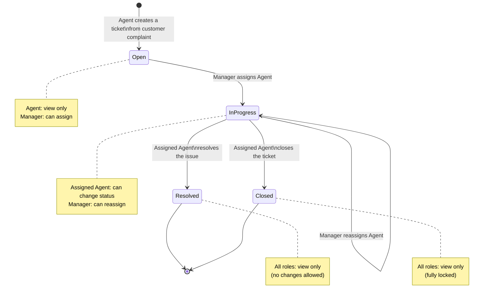

# Role & Scenario Document
## Customer Support Ticket Management System

---

## 1. Actors (Roles)

| Actor | Description |
|---|---|
| **Customer** | External party who submits a complaint/issue. Not a system user (does not log in). |
| **Support Agent** | Creates a ticket based on the customer's complaint, and resolves tickets assigned to them. |
| **Manager** | Assigns/reassigns agents to tickets, and monitors ticket progress. |

---

## 2. Ticket Status

A ticket has 4 statuses that flow linearly:

```
Open  →  In Progress  →  Resolved / Closed
```

| Status | Meaning |
|---|---|
| **Open** | Ticket has just been created, not yet assigned to any agent. |
| **In Progress** | Ticket has been assigned to an agent and is being worked on. |
| **Resolved** | The issue has been resolved by the assigned agent. |
| **Closed** | Ticket is officially closed; no further changes are allowed. |

---

## 3. Scenario Flow (Narrative)

1. **Customer complains** — The customer reports an issue to a Support Agent (via email/support channel).
2. **Agent creates a ticket** — The agent records the complaint by creating a new ticket in the system.
3. **Initial status: Open** — A newly created ticket is automatically set to **Open**. At this stage, the agent can only **view the ticket details**; no other action is available to the agent yet.
4. **Manager performs assignment** — The Manager selects an agent to handle the ticket. Once assigned, the ticket status automatically changes from **Open** to **In Progress**.
5. **Reassignment while In Progress** — While the ticket is still **In Progress**, the Manager can still change (reassign) the agent handling the ticket.
6. **Agent resolves the ticket** — The agent currently assigned to the ticket can change its status to **Resolved** or directly to **Closed**.
7. **Resolved/Closed tickets are locked from the Manager** — Once a ticket becomes **Resolved** or **Closed**, the Manager can **no longer make any changes** to it (including reassignment).
8. **Closed tickets are fully locked** — Once a ticket becomes **Closed**, neither the Agent nor the Manager has any **edit access** to it anymore.
9. **View access is always available** — Regardless of status, both roles (Agent and Manager) can **always view the ticket details** at any time.

---

## 4. Ticket Status Flow Diagram



---

## 5. Permission Matrix

| Ticket Status | Support Agent (not assigned) | Support Agent (assigned) | Manager | View Detail |
|---|---|---|---|---|
| **Open** | View only | — (no assignment yet) | Assign agent → status becomes *In Progress* | ✅ All roles |
| **In Progress** | View only | Change status → *Resolved* / *Closed* | Reassign agent | ✅ All roles |
| **Resolved** | View only | View only | View only (no edit) | ✅ All roles |
| **Closed** | View only | View only | View only (no edit) | ✅ All roles |

**Notes:**
- Only the **currently assigned agent** on a ticket has the right to change its status to Resolved/Closed.
- Once a ticket becomes **Resolved**, the Manager loses the ability to reassign or make any changes.
- Once a ticket becomes **Closed**, the ticket is fully locked from both roles — it can only be viewed, not modified by anyone.
- **View detail** access is universal and never lost at any status, for both roles.

---

## 6. List & History Visibility Restrictions

In addition to the status-based permissions above, there is an extra restriction specific to the **Ticket List** and **Ticket History**:

- A **Support Agent** can only see a ticket in the Ticket List or Ticket History **if**:
  - the ticket is **assigned to them**, **or**
  - the ticket was **created by them**.
- Tickets outside of these two conditions **will not appear** in that agent's Ticket List or Ticket History.
- The **Manager** is not subject to this restriction — a Manager can always see **all tickets** in the Ticket List and Ticket History.

> Note: this restriction applies at the *listing/history* level, separate from the *view detail* permission in Section 5 (viewing an individual ticket's detail remains open to both roles at any status, as long as the agent is actually entitled to see that ticket under the rule above).

---

## 7. Action Summary per Role

### Support Agent
- Creates a new ticket from a customer complaint (initial status: Open).
- Can view ticket details at any time (all statuses) — subject to the list/history visibility rule in Section 6.
- **If currently the assignee** on an *In Progress* ticket: can change its status to Resolved or Closed.
- On the Ticket List/History, only sees tickets assigned to them or created by them.

### Manager
- Can view ticket details at any time (all statuses), for all tickets.
- Assigns an agent to a ticket in **Open** status (changing it to In Progress).
- Can **reassign** the agent while the ticket is still **In Progress**.
- **Has no edit rights** once a ticket becomes Resolved or Closed.
- On the Ticket List/History, sees all tickets without restriction.
