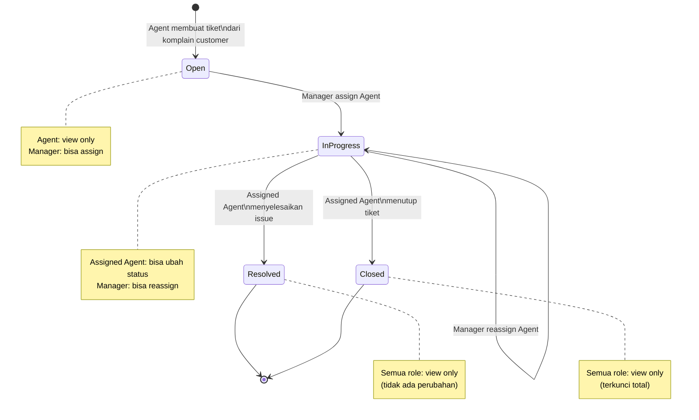

# Role & Scenario Document
## Customer Support Ticket Management System

---

## 1. Aktor (Roles)

| Aktor | Deskripsi |
|---|---|
| **Customer** | Pihak eksternal yang menyampaikan keluhan/issue. Bukan pengguna sistem (tidak login). |
| **Support Agent** | Membuat tiket berdasarkan komplain customer, dan menyelesaikan tiket yang di-assign kepadanya. |
| **Manager** | Melakukan assign/reassign agent ke tiket, serta memantau progress tiket. |

---

## 2. Status Tiket

Tiket memiliki 4 status yang berjalan secara linear:

```
Open  →  In Progress  →  Resolved / Closed
```

| Status | Arti |
|---|---|
| **Open** | Tiket baru dibuat, belum di-assign ke agent manapun. |
| **In Progress** | Tiket sudah di-assign ke seorang agent dan sedang dikerjakan. |
| **Resolved** | Issue sudah diselesaikan oleh agent yang di-assign. |
| **Closed** | Tiket resmi ditutup, tidak ada perubahan lagi yang diizinkan. |

---

## 3. Skenario Alur (Narrative Flow)

1. **Customer complain** — Customer menyampaikan keluhan terkait suatu issue kepada Support Agent (melalui email/kanal support).
2. **Agent membuat tiket** — Agent mencatat komplain tersebut dengan membuat tiket baru di sistem.
3. **Status awal: Open** — Tiket yang baru dibuat otomatis berstatus **Open**. Pada tahap ini, agent hanya bisa **melihat detail** tiket; belum ada aksi lain yang bisa dilakukan agent terhadap tiket tersebut.
4. **Manager melakukan assign** — Manager memilih agent untuk menangani tiket. Begitu assign dilakukan, status tiket otomatis berubah dari **Open** menjadi **In Progress**.
5. **Reassign selama In Progress** — Selama tiket masih berstatus **In Progress**, Manager tetap dapat mengganti agent yang di-assign (reassign) ke tiket tersebut.
6. **Agent menyelesaikan tiket** — Agent yang sedang di-assign pada tiket tersebut dapat mengubah status tiket menjadi **Resolved** atau langsung **Closed**.
7. **Tiket Resolved/Closed terkunci dari Manager** — Setelah tiket berstatus **Resolved** atau **Closed**, Manager **tidak bisa lagi** melakukan perubahan apapun terhadap tiket (termasuk reassign).
8. **Tiket Closed terkunci total** — Setelah tiket berstatus **Closed**, baik Agent maupun Manager **sama-sama tidak punya akses edit** terhadap tiket tersebut.
9. **Akses lihat (view) selalu terbuka** — Terlepas dari status apapun, kedua role (Agent dan Manager) **selalu bisa melihat detail tiket** kapan saja.

---

## 4. Diagram Alur Status Tiket



---

## 5. Matriks Hak Akses (Permission Matrix)

| Status Tiket | Support Agent (bukan yang di-assign) | Support Agent (yang di-assign) | Manager | View Detail |
|---|---|---|---|---|
| **Open** | View only | — (belum ada assignment) | Assign agent → status jadi *In Progress* | ✅ Semua role |
| **In Progress** | View only | Ubah status → *Resolved* / *Closed* | Reassign agent | ✅ Semua role |
| **Resolved** | View only | View only | View only (tidak bisa edit) | ✅ Semua role |
| **Closed** | View only | View only | View only (tidak bisa edit) | ✅ Semua role |

**Catatan:**
- Hanya **agent yang sedang di-assign** pada tiket yang berhak mengubah status tiket menjadi Resolved/Closed.
- Setelah tiket menjadi **Resolved**, Manager kehilangan hak untuk reassign atau mengubah apapun.
- Setelah tiket menjadi **Closed**, tiket terkunci total dari kedua role — hanya bisa dilihat, tidak bisa diubah oleh siapapun.
- Hak **view detail** bersifat universal dan tidak pernah hilang di status manapun, untuk kedua role.

---

## 6. Batasan Visibilitas List & History

Selain hak akses per status di atas, terdapat batasan tambahan khusus untuk **Ticket List** dan **Ticket History**:

- **Support Agent** hanya bisa melihat tiket pada Ticket List maupun Ticket History **jika**:
  - tiket tersebut **di-assign kepada dirinya**, **atau**
  - tiket tersebut **dibuat oleh dirinya sendiri**.
- Tiket di luar dua kondisi tersebut **tidak akan muncul** di Ticket List maupun Ticket History milik agent tersebut.
- **Manager** tidak memiliki batasan ini — Manager tetap bisa melihat **seluruh tiket** pada Ticket List maupun Ticket History.

> Catatan: batasan ini berlaku di level *listing/history*, terpisah dari hak akses *view detail* pada bagian 5 (view detail tiket individual tetap terbuka untuk kedua role di semua status, selama agent tersebut memang berhak melihat tiket itu berdasarkan aturan di atas).

---

## 7. Ringkasan Aksi per Role

### Support Agent
- Membuat tiket baru dari komplain customer (status awal: Open).
- Melihat detail tiket kapan saja (semua status).
- **Jika sedang menjadi assignee** pada tiket berstatus *In Progress*: dapat mengubah status menjadi Resolved atau Closed.

### Manager
- Melihat detail tiket kapan saja (semua status).
- Meng-assign agent pada tiket berstatus **Open** (mengubah status menjadi In Progress).
- Melakukan **reassign** agent selama tiket masih berstatus **In Progress**.
- **Tidak punya hak edit** apapun setelah tiket berstatus Resolved atau Closed.
